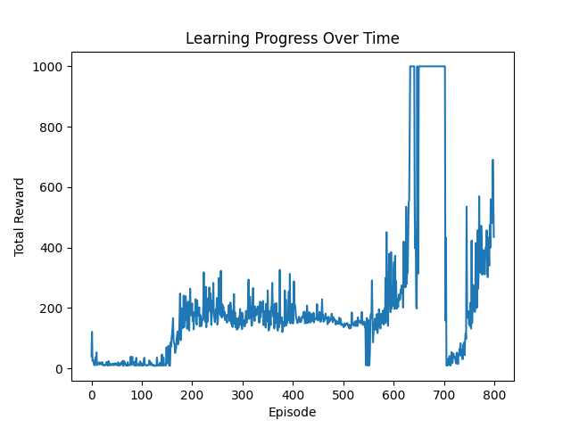

# Cart Pole DQN

In this repository, I have trained a deep neural network learn to control a cart on a rail to keep an attached pole vertically balanced. I did this with a Reinforcement Learning (RL) approach, in which the technique is called a Deep-Q Network (DQN). It was first introduced in [this](https://arxiv.org/abs/1312.5602) paper to play Atari.

## The environment

Below is an image of the cart pole setup. The goal is to keep the pole balanced in the vertical position for as long as possible by controlling the black cart. 

The training was done in Gymnasium's [cart pole](https://gymnasium.farama.org/environments/classic_control/cart_pole/) environment, maintained by the Farama foundation.

### Actions

An agent can do only do 1 of 2 actions. Unfortunately there is somehow no 'do nothing' which I find strange, but here we are:
- 0 - push the cart left
- 1 - push the cart right

### Reward

In the environment, a "time step" refers to a The reward given by the Gymnasium cart-pole environment is `+1` for every time step. In simple terms, the goal is to 'stay alive' for as long as possible.

### Modelling the system

From a physics standpoint, the system can be [modelled](https://underactuated.mit.edu/acrobot.html#cart_pole) by a system of second order differential equations, and then controlled with PID. 

Modelling the state vector with:  

$$ 
\mathbf{q} = \begin{bmatrix} x \\ \theta \end{bmatrix}
$$  

where scalar $x$ is the distance of the cart from the left and $\theta$ is the angle of the pole with the vertical ray pointing down from the cart, and  

$$ 
\mathbf{x} = \begin{bmatrix} q \\ \dot{q} \end{bmatrix}
$$  

the goal is to "stabilize the unstable fixed point" (a classic point of discussion in signals & systems) at  

$$ 
\mathbf{x} = \begin{bmatrix} 0 \\ \pi \\ 0 \\ 0 \end{bmatrix}
$$

But as with many such systems, we can employ a trained machine learning model to control it, which can be universally applicable regardless of physical modelling!

### Observation

In the Gymnasium environment, the agent receives an output each time it carries out an action using the API function `env.step(action)`. This output contains the state vector $\mathbf{x}$ described above, and defines a unique state in the environment.

## An overview of the repository

The file `agent.py` contains methods to train and execute actions for the cart pole controller agent, and the file `train_cartpole.py` runs training cycles and captures a video of the trained agent in action! 

The agent was trained using [TensorFlow](https://www.tensorflow.org/install/source), which I initially found slightly unwieldy, but found out is just as cool as PyTorch. 

The folder `video-demo` contains a 10-second video of the agent balancing the pole. 

The folder `learning-curves` contains various images of learning progresssions for training rounds. Graphing those helped me gauge the stability and quality of the model training.

Finally, file `requirements.txt` has a list of libraries needed not only for training, but also for capturing videos.

## The Theory Behind Deep-Q Learning

From the standpoint of running and training the agent, all the details were abstracted away into the class called `Cartpole_RL_Agent` to make the code clean. But to learn how it works, we first need some theory.

In classic Q-learning, the algorithm tries to learn a value describing the 'goodness' or 'quality' (the meaning of Q) of taking action `a` from state `s`. At every state `s` in the 'game' it chooses the `a` yielding the highest Q(s, a). 

This is an example of model-free, off-policy reinforcement leaerning. It is model-free, because we are not estimating any reward or transition probability function from the Markov Decision Process. It is also off-policy because the learned policy for the agent is not the one that generates training samples. This is because Q-learning follows the recursive Bellman equation updates: 

$$ 
Q(s, a) \leftarrow \hat{Q}(s, a) + \alpha \cdot (r + (\gamma \cdot \underset{a' \in Actions(s)}{argmax}Q(s', a')) - \hat{Q}(s, a))
$$ 

where s is any non-terminal state, s' is the next state, and a is the action to go from s to s'. Alpha is the learning rate, and a' is an action from state s', from which we simply choose the one that yields the highest Q-value.

On the right side of the arrow, if Q hat and Q were the same, the algorithm would be "chasing" its own tail due to its recursive nature, leading to a high level of instability.

So Q-learning separates them into the target and estimation. The *target* (the Q without the hat) is the ideal Q-value, and the estimation (with the hat, as is with statistics) is the current value.

In high-dimensional problems such as the cart-pole, it is impossible to store a Q-table, so we use a neural network to approximate the Q function, which takes in the state observation `s` and outputs a vector of all Q(s), in which different elements of Q(s) correspond to different Q(s, a)

The target Q-values will be predicted using a separate neural network to ensure training stability. However, we do not know the real target, so we have to estimate it by measuring the difference with respect to the Q-network. 

Thus, the target network is periodically updated to match the values of the Q-network. Similarly, the Q-network also does so with respect to the target network, using the Bellman equation given above.

This *amazing* result is therefore a feedback mechanism between the two-deep neural networks which are 'linked' together to produce a stable, and gradually improving learning progression.

## The Training Loop

The training was written using the TensorFlow machine learning library, in which I bulit a custom training loop from scratch to have more control over loss calculations and gradient descent. 

All training methods are localed in `agent.py` and are primarily based in `train_episodes`, `compute_loss`, and `agent_learn`.

From the original paper, it goes as follows:

### Speed Optimizations

I added the compiler flag `@tf.function` outside of the function `agent_learn()` to make it construct a static computation graph. 

But since such computations tend to be expensive if run repetitively on different samples, I carried such updates periodically, once every 3 time steps. This sped up execution by 500%.

## The Memory Buffer

The experience replay buffer was bulit using a size-limited deque of `NamedTuple` elements. 

One drawback of the design is: once it reaches peak rewards, the memory fills up with experiences from which the agent does not learn (i.e. already learned, doesn't care). So the model does not improve and even has potential to fall back, as was demonstrated in this curve below. 

The solution will be to use Prioritized Experience Replay - upcoming!!!

